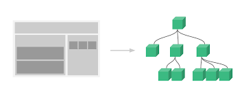

# I. vue.js ?

##### 웹페이지 화면을 개발하기 위한 Front-End FrameWork입니다.

## II. Vue의 장점

+ 배우기 쉽다?

+ 리엑트 장점 + 앵귤러 장점

+ 리엑트와 앵귤러에 비해 우수한 성능

## Vue 의 특징

##### 1. UI 화면단 라이브러리

| 용어                        | 설명                                                         |
| --------------------------- | ------------------------------------------------------------ |
| 뷰(view)                    | 사용자에게 보이는 화면                                       |
| 돔(DOM)                     | HTML 문서에 들어가는 요서(태그, 클래스, 속성 등)의 정보를 담고 있는 데이터 트리 |
| 돔 리스너(DOM Listener)     | 돔의 변경내역에 대해 즉각적으로 반응하여 특정 로직을 수행하는 장치 |
| 모델(Model)                 | 데이터를 담는 용기, 보통은 서버에서 가져온 데이터를 자바스크립트 객체 형태로 저장 |
| 데이터 바인딩(Data Binding) | 뷰(View)에 표시되는 내용과 모델의 데이터를 동기화            |
| 뷰 모델(View Model)         | 뷰와 모델의 중간영역, 돔리스너와 데이터 바인딩을 제공하는 영역 |

##### 2. 컴포넌트 기반 프레임워크

