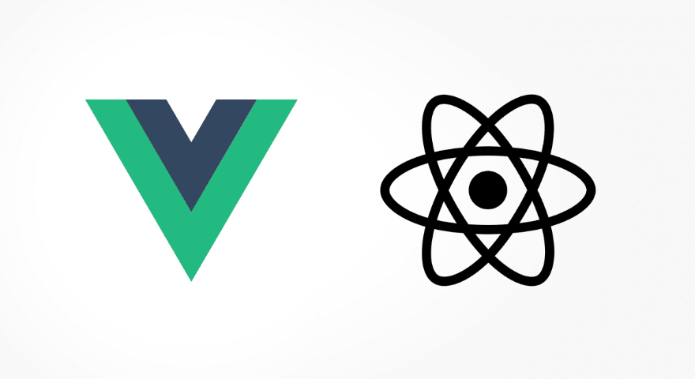

#  I. 개발환경



+ [Atom]([https://atom.io](https://atom.io/))
+ [Chrome](https://www.google.com/intl/ko/chrome/)
+ [Node.js](https://nodejs.org/ko/)


##### 1. Atom Settings

###### windows

```
[File - Settings]
```

###### Mac

```
[Atom - Preference]
```

<hr>

```
[Install - Theme]
```

+ seti - ui
+ atom - material - syntax - dark

###### Theme 적용

```
[Theme - UI Theme]
select Seti
```

<hr>

###### Vue Package 설치

```ㅑㅜ
[Install - Packages]
language-vue 설치
```


# II. Sample Vue

###### 코드

```html
<!DOCTYPE html>
<html>
  <head>
    <meta charset="utf-8">
    <title>vue sample</title>
  </head>
  <body>
    <div id="app">
      {{message}}
    </div>
    <script src="https://cdn.jsdelivr.net/npm/vue@2.5.2/dist/vue.js"></script>

  <script>
    new Vue({
      el:'#app',
      data:{
        message:'Hello Vue.js'
      }
    });

  </script>
  </body>
</html>
```

###### 결과

```
Hello Vue.js
```

