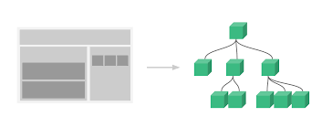

# I. Vue 인스턴스

##### 1. 정의

###### 화면 개발을 위해 필수적으로 생성하는 기본 단위

```vue
new Vue({
	el:'#app',
	data:{
		message:'Hello Vue.js'
	}
});
```

+ el 속성으로 뷰 인스턴스가 그려질 지점 선택
+ data 속성에 message값을 정의

| 속성     | 설명                      |
| -------- | ------------------------- |
| template | 화면에 표시되는 html, css |
|methods|화면내 전반적인 동자가과 이벤트|
|created|Vue 인스턴스가 생성되자마자 실행할 로직을 정의(라이프 사이클 참고)|


##### 2. 인스턴스 유효범위


##### 3. 라이프 사이클


###### 예제
```html
<!-- 라이프 사이클에서 데이터 변경이 일어나고, 화면이 다시 그려질 때 updated -->
<!DOCTYPE html>
<html>

<head>
  <meta charset="utf-8">
  <title>vue lifecycle</title>
</head>

<body>
  <div id="app">
    {{message}}
  </div>
  <script src="https://cdn.jsdelivr.net/npm/vue@2.5.2/dist/vue.js"></script>

  <script>
    new Vue({
      el: '#app',
      data: {
        message: 'Hello Vue.js'
      },
      beforeCreate: function() {
        console.log("beforeCreate");
      },
      created: function() {
        console.log("created");
      },
      mounted: function() {
        console.log("mounted");
        this.message="Hello World!" 
        <!-- message값 변경 -->
      },
      updated: function() {
        console.log("updated");
      },
    });
  </script>
</body>
</html>
```


# II. Vue 컴포넌트




