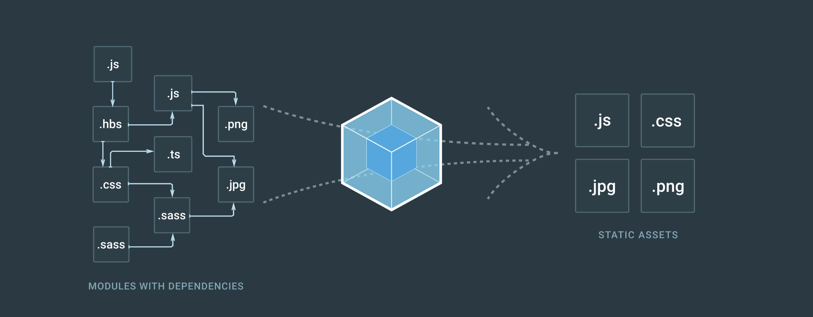

# I. Start React!!!

### 1. React란?

#### React는 Angular, Vue.js와 같이 현재 가장 주목 받는 프레임워크입니다.

#### React, Angular, Vue.js in Graph

#### 리액트의 장점

- 공개 소프트웨어

- 화면 출력에 특화된 프레임워크

- 컴포넌트로 화면 구성을 효율적으로 가능

#### NPM(Node Package Manager)

##### [npmjs](https://www.npmjs.com) 에서 필요한 라이브러리를 내려받아 설치하고 삭제하는 등의 관리를 해주는 프로그램

-  node_modules폴더에 라이브러리를 저장
-  package.json파일에 설치된 라이브러리의 정보를 작성하여 저장

##### 장점 : 라이브러리의 용량이 굉장히 큰 경우 프로젝트를 공유하는데 많은 시간과 자원이 소모되는데,이때, 용량이 큰 라이브러리를 전송 할 필요 없이 package.json의 목록을 이용하면 손쉽게 라이브러리를 내려받을 수 있다.

#### Webpack

##### 웹브라우저가 분석할 수 없는 파일을 .js .css등으로 변환

