###### I. React

## 2. React 개발환경

- NVM(Node Version Manager)으로 node.js설치
- yarn, create-react-app 설치
- Visual Studio Code 와 플러그인 설치


#### NVM으로 Node.js 설치

1. NVM 설치하기

   - nvm-setup.zip을 다운받은 뒤 설치
   - [NVM DOWNLOAD 링크](https://github.com/coreybutler/nvm-windows/releases)

   - NVM 버전확인하기(명령프롬포트)

     ```
     > nvm -v
     Running version 1.1.7
     ...
     ```

2. Node.js 설치하기

   ```
   > nvm install 8.10.0
   Downloading node.js version 8.10.0 (64-bit)...
   Complete
   ... ...
   Downloading npm version 5.6.0... Complete
   Installing npm v5.6.0...
   ```

3. Node.js 설정

   - NVM으로 설치한 Node.js를 사용하기 위한 설정

   - node.js와 npm버전 확인

     ```
     > nvm use 8.10.0
     Now using node v8.10.0 (64-bit)
     > node -v
     v8.10.0
     > npm -v
     5.6.0
     ```


#### yarn과 create-react-app 설치

1. yarn설치

   ```
   > npm install -g yarn
   ```

2. create-react-app 설치

   ```
   > yarn global add create-react-app
   또는
   > npm install -g create-react-app
   ```

3. 리액트 앱 설정

   - demoreact라는 이름으로 리액트 앱 생성

     ```
     > create-react-app demoreact
     ```

4. 리액트 앱 구동

   ```
   > cd demo-react
   > yarn start
   ```

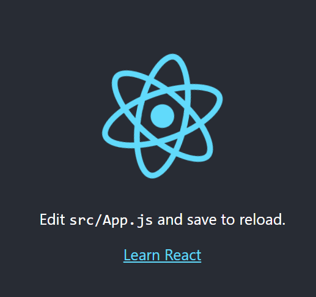


#### 라이브러리 설치

1. package.json 수정 - [참고파일 링크](https://github.com/dongqda/demo-react/blob/master/package.json)

   ```json
   {
     "name": "demo-react",
     "version": "0.1.0",
     "private": true,
     "dependencies": {
       "axios": "0.18.1",
       "enzyme": "^3.8.0",
       "enzyme-adapter-react-16.3": "^1.4.1",
       "moment": "^2.24.0",
       "next": "^8.1.0",
       "react": "^16.7.0",
       "react-dom": "^16.7.0",
       "react-redux": "^6.0.0",
       "react-router-dom": "^5.0.0",
       "react-scripts": "2.1.7",
       "react-test-renderer": "^16.7.0",
       "react-with-styles": "^3.2.1",
       "recompose": "^0.30.0",
       "redux": "^4.0.1",
       "redux-pack": "^0.1.5",
       "redux-thunk": "^2.3.0",
       "reselect": "^4.0.0",
       "selector-action": "^1.1.1"
     },
     "scripts": {
       "dev": "next",
       "predeploy": "yarn build-all",
       "deploy": "firebase deploy",
       "build-all": "yarn ssrbuild && yarn build-firebase",
       "build-firebase": "cd \"./functions\" && yarn --ignore-engines",
       "ssrbuild": "next build",
       "storybook": "start-storybook -p 9001 -c .storybook",
       "start": "react-scripts start",
       "build": "react-scripts build",
       "test": "react-scripts test",
       "mockserver": "json-server --watch --delay 500 --port 4000 mock/create.js",
       "errorserver": "node mock/fake.js",
       "eject": "react-scripts eject"
     },
     "eslintConfig": {
       "extends": "react-app"
     },
     "browserslist": [
       ">0.2%",
       "not dead",
       "not ie <= 11",
       "not op_mini all"
     ],
     "devDependencies": {
       "@babel/core": "7.5.5",
       "@babel/plugin-syntax-object-rest-spread": "^7.2.0",
       "@storybook/addon-actions": "^5.2.6",
       "@storybook/addons": "^5.2.6",
       "@storybook/react": "^5.2.6",
       "aphrodite": "^2.2.3",
       "babel-loader": "^8.0.5",
       "json-server": "^0.14.2",
       "node-sass": "^4.11.0",
       "react-with-styles-interface-aphrodite": "^5.0.1",
       "redux-devtools-extension": "^2.13.8",
       "sass-loader": "^7.1.0",
       "storybook-addon-jsx": "^7.1.13"
     }
   }
   ```

2. package.json에 적힌 라이브러리 모두 설치

   ```
   > yarn
   ```

3. babel-loader 호환성 오류 해결

   - `.env`파일 생성 후 아래 내용 작성

     ```
     SKIP_PREFLIGHT_CHECK = true
     ```
     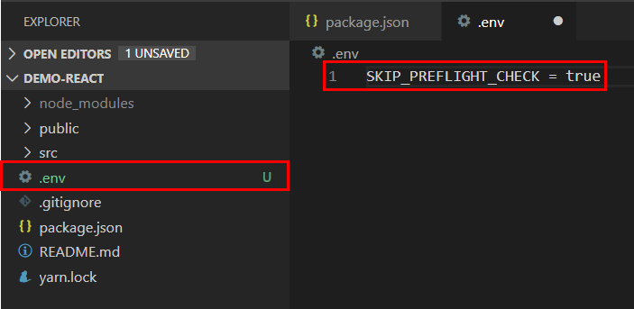


#### Visual Studio Code와 Plug-in 설치

1. React.js code Snippets 플러그인 설치

   - 리액트에서 자주 사용하는 코드뭉치를 수정

   - `Extentions`에서 'reactjs code snippets' 검색(`ctrl` + `shift` + `x`)

   - 플러그인 선택 후 설치

     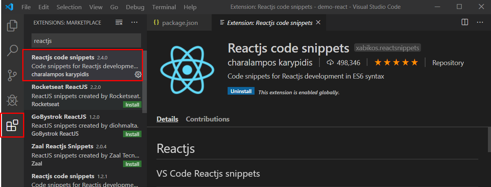

   - 비주얼 스튜디오 재실행

   

2. src 폴더에 01 폴더 생성 후 `RCC.jsx` 파일 생성

   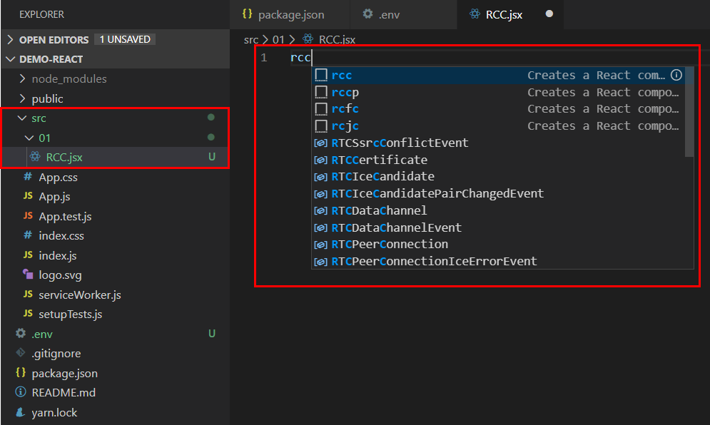

   

3. `Enter`키를 누르면 코드 자동 생성

   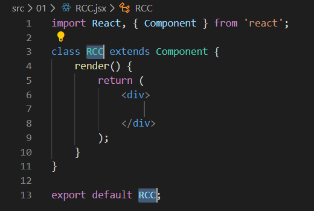

   - Reactjs code snippets에서 자주 사용되는 단축키워드

     | 키워드 | 설명                                               |
   | ------ | -------------------------------------------------- |
   | RCC    | 기본 리액트 컴포넌트 코드를 생성합니다.            |
   | RCCP   | 리액트 컴포넌트를 프로퍼티 타입과 함께 생성합니다. |
   | RCFC   | 리액트 컴포넌트를 생명주기 함수와 함께 생성합니다. |
   | RPC    | 리액트 퓨어 컴포넌트를 생성합니다.                 |
   | RSC    | 함수형 컴퓨넌트를 생성합니다.                      |
   | RSCP   | 함수형 컴퓨넌트를 프로퍼티 타입과 함께 생성합니다. |


4. Prettier 플러그인 설치
   
   - 코드 줄바꿈등의 스타일을 자동으로 변환
   
     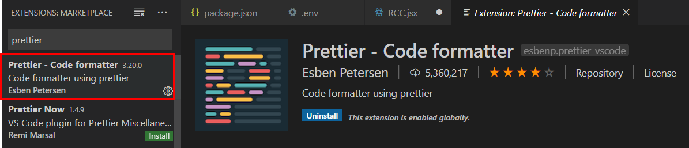
   
   - 비주얼 스튜디오 재실행 
   
   
   
5. 프로젝트 루트 폴더(demo-react)내에 Prettier 설정파일 생성

     - 파일명에는 반드시 점(.)을 포함해야 한다.
       
     - 파일명 : `.prettierrx`

       ```json
       {
           "useTabs": false,
           "printWidth": 100,
           "tabWidth": 2,
           "trailingComma": "all",
           "semi": true,
           "singleQuote": true
         }
       ```
       - 탭을 사용할 때 빈칸으로 채움
       - 파일 최대 길이를 100칸으로 지정
       - 탭의 빈칸을 두칸으로 지정
       - 나열 항목의 마지막에 항상 쉼표(,)를 붙인다.
       - 실행 줄 마지막에 항상 세미콜론(;)을 붙인다.
       - 문자 따옴표를 작은 따옴표('')로 통일한다.

       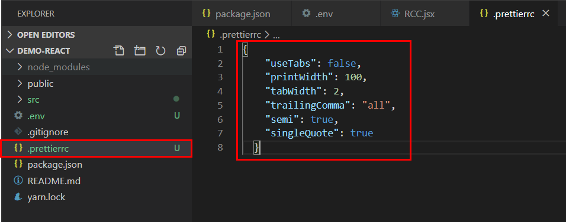
       
       

6. prettier로 코드 스타일 적용

     - `RCC.jsx` 파일을 열기

     - `Ctrl` + `Shift` + `P`

       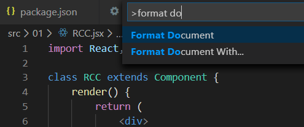
       
       

7. 자동으로 prettier 설정

   - `file` > `preference` > `settings`
   
     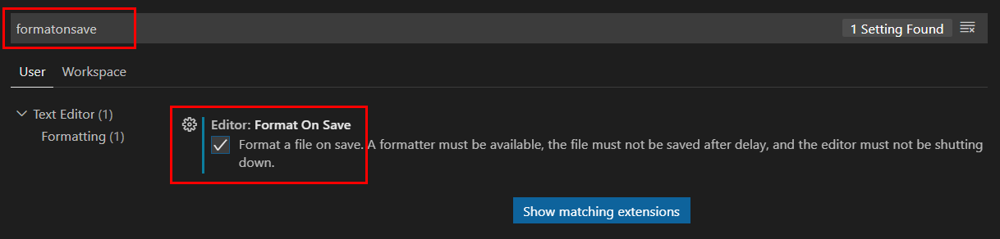
     
     
   
8. 코드 수정 후 테스트
   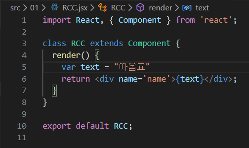
   

   
9. 저장 후 코드
   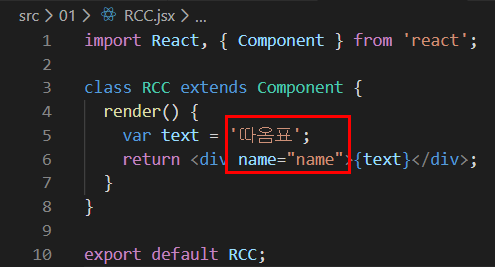


​     


