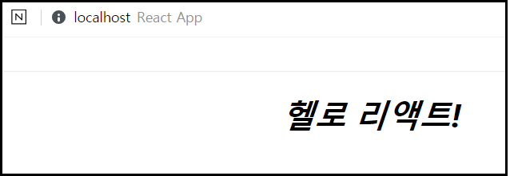

###### I. React

## 3. React 앱 수정

#### App.css를 수정하여 화면스타일을 변경

1. `App.css` 수정

   - `App.css` 코드의 맨 아래 코드를 추가한다.

     ```css
     ...
     .title{
     	font-style : italic;
     }
     ```

   

2. 스타일 적용

   - `src`폴더의 `App.js`파일을 수정

     ```js
     import React, { Component } from 'react';
     import logo from './logo.svg';
     import './App.css';
     
     class App extends Component {
       render() {
         return (
           <div className="App">
             <h1 className="title">헬로 리액트!</h1>
           </div>
         );
       }
     }
     
     export default App;
     ```

   - `render()` 함수는 HTML을 반환 (웹브라우저에 출력)

   - JavaScript의 class 이름은 React에서는 className으로 사용

   

3. 리액트 핫리로딩으로 변경된 화면

   - Hot Reloading이라는 모듈으로 저장한 즉시 화면 적용

   


